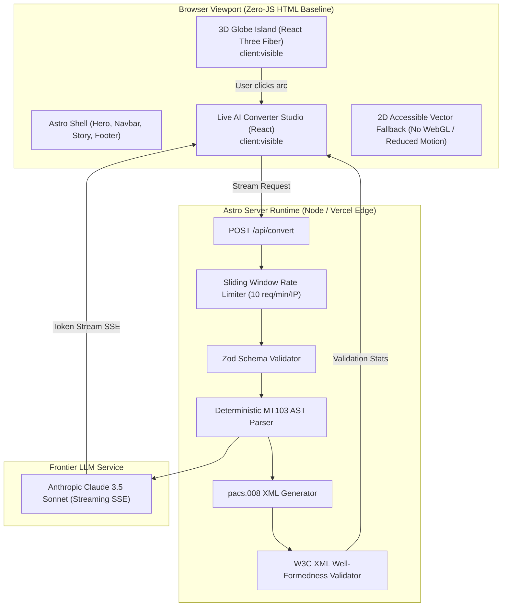

# SwiftFlow 3D 🌐⚡

[](https://github.com/your-username/swiftflow-3d/actions/workflows/ci.yml)
[](https://pagespeed.web.dev/)
[](https://www.typescriptlang.org/)
[](https://opensource.org/licenses/MIT)

> **SwiftFlow 3D** is a production-quality FinTech portfolio project showcasing an interactive 3D global payment mesh, legacy SWIFT MT103 telemetry inspection, and real-time AI-assisted migration to ISO 20022 `pacs.008.001.08` XML.

---

## 🏛️ System Architecture

Built on **Astro's Islands Architecture**, SwiftFlow 3D isolates client-side JavaScript strictly to interactive islands, hydrating the Three.js canvas only when visible in the viewport (`client:visible`).



---

## ✨ Key Features

1. **3D Animated Interbank Globe**
   - Glowing Bezier arcs connecting tier-1 global clearing hubs (New York, London, Frankfurt, Tokyo, Singapore, Zurich, Sydney, Dubai, Hong Kong, São Paulo).
   - Dynamic particle packets traversing arcs at realistic latency intervals.
   - Interactive raycasting: click any arc to launch the **Message Inspector Modal**.
2. **Scroll Storytelling (Fly-Throughs)**
   - 3 interactive scroll chapters driven by GSAP camera moves:
     - **Stage 01**: The Fragility of Legacy MT (1970s format, 35-character truncations, AML false positives).
     - **Stage 02**: The Global Shift to ISO 20022 MX (CBPR+, TARGET2, FedNow, rich XML schemas).
     - **Stage 03**: The SwiftFlow Solution (Zero-data-loss bridging, automated AI compliance).
3. **Live AI Converter & Streaming Studio**
   - Input custom or preset SWIFT MT103 FIN messages.
   - Streams an executive plain-English summary alongside schema-compliant ISO 20022 `pacs.008.001.08` XML token-by-token.
   - Built-in W3C XML well-formedness validation verifying tag balance and attributes before rendering success feedback.
4. **Message Inspector & MT ↔ MX Mapping Matrix**
   - Click any arc or corridor to review legacy tags (`:20:`, `:23B:`, `:32A:`, `:50K:`, `:59:`, `:70:`, `:71A:`) mapped directly against ISO XML elements.
5. **Accessibility & Lighthouse 90+**
   - High-contrast 2D SVG vector fallback for devices without WebGL.
   - Automatic detection of `(prefers-reduced-motion: reduce)`.
   - Full ARIA compliance, accessible keyboard navigation, and focus indicators.

---

## 🛠️ Tech Stack

| Layer | Technologies |
|---|---|
| **Framework** | [Astro 4](https://astro.build/) (Islands Architecture, Server Output) |
| **3D Rendering** | [Three.js](https://threejs.org/), [React Three Fiber](https://docs.pmnd.rs/react-three-fiber), [@react-three/drei](https://github.com/pmndrs/drei) |
| **Animation** | [GSAP](https://greensock.com/gsap/) + ScrollTrigger |
| **Styling** | [Tailwind CSS](https://tailwindcss.com/) with Custom Dark Glassmorphism |
| **AI Integration** | [@anthropic-ai/sdk](https://github.com/anthropics/anthropic-sdk-typescript) (Server-Side Claude 3.5 Sonnet) |
| **Validation** | [Zod](https://zod.dev/) & Custom W3C XML Validator |
| **Testing** | [Vitest](https://vitest.dev/) (Unit Tests) & [Playwright](https://playwright.dev/) (E2E) |
| **CI/CD** | GitHub Actions Workflow (`ci.yml`) |

---

## 🚀 Quickstart Guide

### 1. Prerequisites
- **Node.js**: `v20.x` or higher
- **npm**: `v10.x` or higher

### 2. Installation
```bash
# Clone the repository
git clone https://github.com/your-username/swiftflow-3d.git
cd swiftflow-3d

# Install dependencies
npm install
```

### 3. Environment Configuration (Optional)
Copy `.env.example` to `.env`:
```bash
cp .env.example .env
```
Fill in your Anthropic API Key:
```env
ANTHROPIC_API_KEY=sk-ant-api03-...
```
> *Note: If no API key is provided, SwiftFlow 3D will automatically engage its high-fidelity offline deterministic engine so all features, streaming animations, and pacs.008 XML generation work seamlessly out-of-the-box!*

### 4. Running Locally
```bash
# Start Astro development server
npm run dev
```
Open [http://localhost:4321](http://localhost:4321) in your browser.

---

## 🧪 Testing Suite

### Unit Tests (Vitest)
Unit tests cover the MT103 FIN parser, ISO 20022 pacs.008 generator, and XML validator:
```bash
npm run test
```

### End-to-End Tests (Playwright)
Validates page hydration, 3D interaction, and live converter token streaming:
```bash
# Run Playwright tests
npm run test:e2e
```

### Type Checking & Linting
```bash
npm run typecheck
```

---

## 🛡️ Synthetic Data Compliance Notice

> **EDUCATIONAL & PORTFOLIO SIMULATION ONLY**  
> All Bank Identifier Codes (BICs), IBAN accounts, institutions, and transaction references in SwiftFlow 3D are **100% synthetic** and generated purely for educational and technical demonstration purposes. No live SWIFT networks or real banking accounts are ever accessed or contacted.

---

## 📄 License
This project is open-source under the [MIT License](LICENSE).
